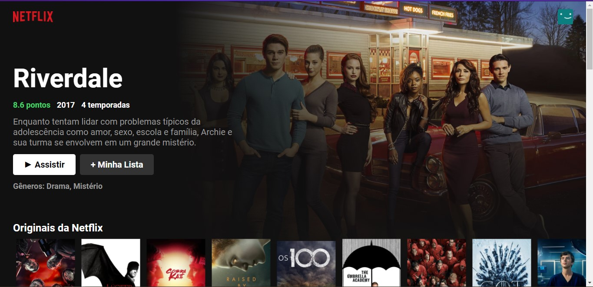
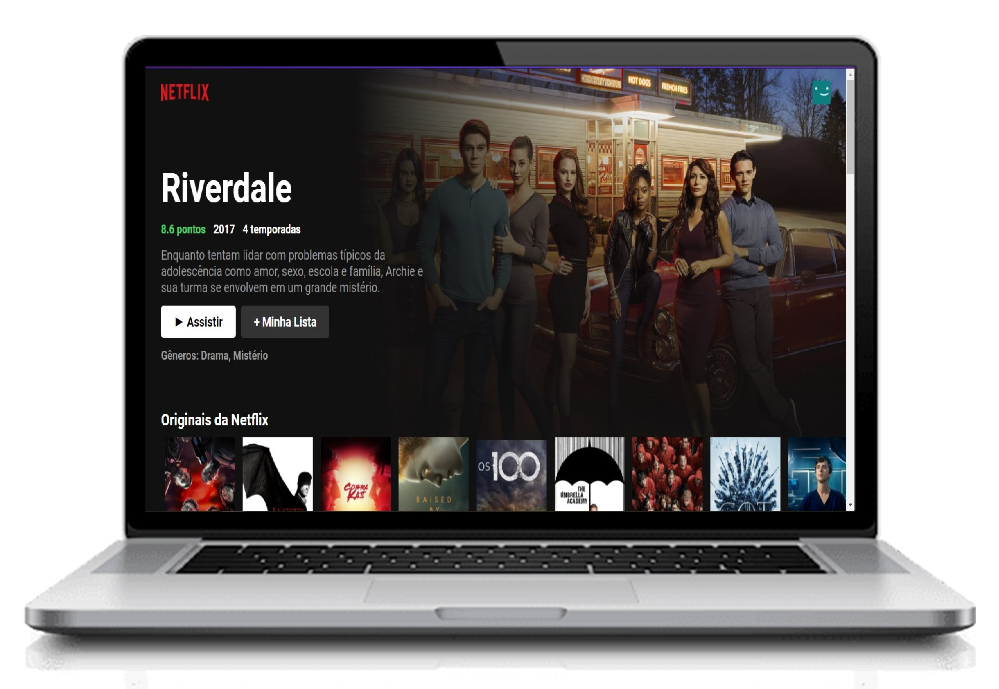
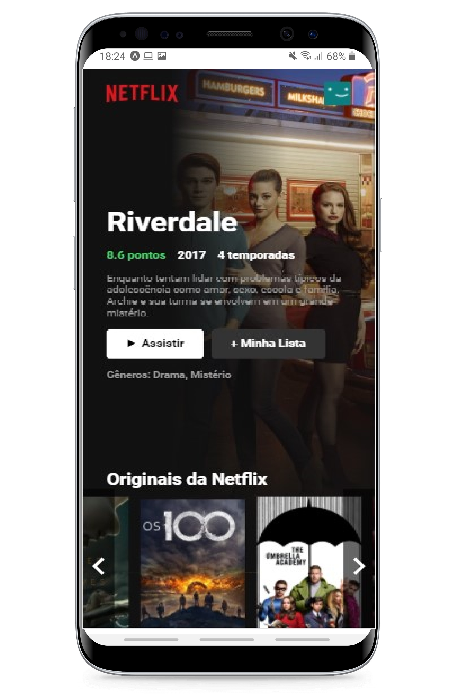

<h3 align="center">
    
      
    

      <a href="#-tecnologias">Tecnologias</a>&nbsp;&nbsp;&nbsp;|&nbsp;&nbsp;&nbsp;
      <a href="#-Como-executar-o-projeto">Como executar o projeto</a>&nbsp;&nbsp;&nbsp;|&nbsp;&nbsp;&nbsp;
      <a href="#-license">Licença</a>
  

</h3>

## 🔖 Sobre

O projeto consiste em fazer um clone do <strong>Netflix</strong> tendo como objetivo principal estudar ReactJS;

## 🖼 Screenshot

  
  

## 🚀 Tecnologias

Esse projeto foi desenvolvido com as seguintes tecnologias:

- [ReactJS](https://pt-br.reactjs.org/)
- [HTML](https://developer.mozilla.org/pt-BR/docs/Web/HTML)
- [CSS](https://developer.mozilla.org/pt-BR/docs/Web/CSS)
- [JavaScript](https://developer.mozilla.org/pt-BR/docs/Web/JavaScript)

## 🎓 Quem ministrou?

A aula foi ministrada pelo **Bonieky Lacerda** no YouTube.

## 🤔 Como executar o projeto

- Faça um fork desse repositório;
- Instale as dependências: `yarn install`;
- Incie o projeto: `yarn start`;
- Acesse o navegador: `http://localhost:3000`.

## 📝 License

Direitos de imagem pertecem a Netflix e os dados da API foram obtidos no site themoviedb.org

---

<h4 align="center">
    Feito por <a href="https://www.linkedin.com/in/welltonquirino95/" target="_blank">Wellton Quirino</a> 🚀
</h4>
